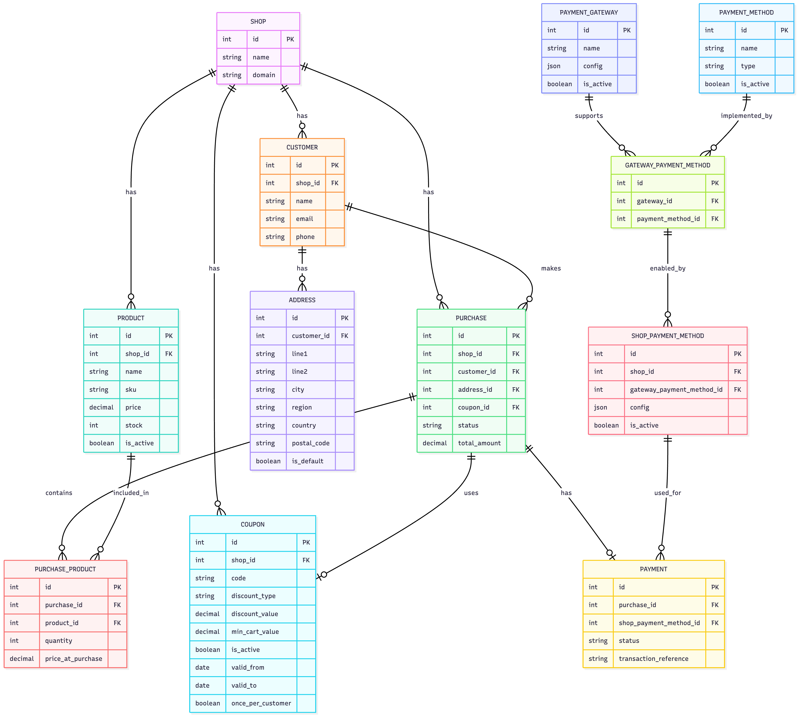

## Important Commands
1. To run migrations:  python manage.py migrate
2. To seed the database:  python manage.py seed_db 
3. To run the server: python manage.py runserver
4. To run tests: pytest

## Overview
This document summarizes the design decisions and trade-offs made during the development of the **Zid Cart system**.  
The system handles purchases, customer management, payments, and coupon validation.

## Architecture
- **Backend:** Django REST Framework
- **Database:** PostgreSQL
- **Testing:** Pytest with pytest-django

## Design Trade-offs
| Decision Area              | Options Considered                                    | Choice & Reasoning                                                                     |
| -------------------------- | ----------------------------------------------------- | ---------------------------------------------------------------------------------------|
| Payment System Abstraction | Direct Stripe calls vs Gateway Interface              | Abstracted to make payment system pluggable thus adding gateways without changing logic|
| Testing Strategy           | Django TestCase vs Pytest                             | Pytest beacuse of simpler syntax, fixtures, and easy test discovery                    |
| Caching                    | Redis, In-memory caching                              | Redis could be added later; for the scope and time constarint of the task not critical |
| Apps Design                | make each module a separate app vs separate services  | Separate apps better for system scalability but given scope services were good enough  |

## Implementation Decisions

1. ## Models and Relaionships
Due to the task scope and time constraint, Models were prioritized based on importance for the scope of this task

- Variant model was not of high importance in this task, it did not affect any of the main functionality and added complexity.
- Coupon model design and features could be better (could add buyX,getY , free shipping,...) but again it did not affect the main functionality and added complexity.
- Courier and Location models did not seem of high importance given the task requirements, so I decided to move past it.
- User model responsible for shop owners, and masteradmins wasn't essential for the task given it didn't implement any dashboard functionality and focused on customers.
- Meta, Tiktok, etc.. were not essential for this task although very important in e-commerce systems. 
- Shipping fees were not added based on the decision not to implement courier and location models.
- Indexes were decided based on the highly used or queried fields to improve performance. 
- Soft deletion for some models would have been useful to the system, but again not essential given the time constraint.

2. ## Validation & Business Rules
validations are very critical in e-commerce. validation bugs could lead to negative or inaccurate stock, wrong pricing, and wrong payments, so it was very important to focus on that part either in coupon or purchase validations. It's also important to return validation errors with simple and informative messages for user experience.  

3. ## Testing
- Used pytest fixtures to create valid purchase scenarios
- Separate tests for services: payments_service, purchases_service, coupons_service

4. ## API Decisions
- Endpoints follow REST conventions: /purchases/, /payments/, /customers/
- All endpoints return JSON with clear status and error messages
- Scoping of the queryset was done based on only customers based on the decision of not supporting other users or dashboard functionalities.

## Future Considerations
- Implement caching for frequent queries
- Add rate-limiting to prevent abuse of coupon endpoints
- Add models that we couldn't add due to time constraint (courier, location, user...etc)
- Add soft deletion
- Include dashboard functionalities.
- Asynchronous jobs for emails, and under the hood and heavy operations.
- Implementing on hold quantity feature to avoid stock issues in case of online payments (product is soldout before the callback is sent). 
- Logs. 
- Better performance observability.
